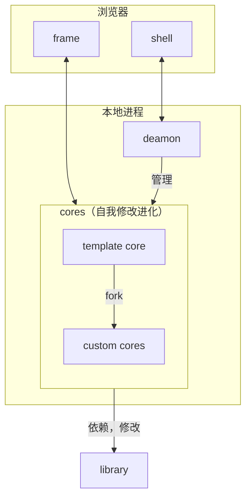

# Comrade Harness

一个后现代 harness：目标是证明在 agent 时代，**纯代码包组合优于传统插件系统**。

> 没错就是针对 DeepSeek Harness


|        | 插件系统                                      | 代码包                                 |
| ------ | --------------------------------------------- | -------------------------------------- |
| 概念   | 额外的概念，额外的包管理，增加 agent 认知负担 | agent 天生理解代码项目结构             |
| 自定义 | 只能全局插入一个单例                          | 函数可以选择调用点，多个调用，分解调用 |
| 限制   | 只能改预留的服务点                            | 无限，你掌握最终的代码                 |
| 生态   | 需要特殊的插件形式                            | 普通的代码包，agent知道怎么用          |
| 热插拔 | 需要满足副作用可逆和可交换                    | 全量重载，因为插拔并非热点路径         |

## 架构



- core 和 libary：标准的代码包，git 管理，全量重载。
  - core：一个 harness 的完整逻辑，任意组合 library 里的组件逻辑。
  - library：harness 的各个组件逻辑。
- deamon：cores 的 控制台，指导激活的 core fork和修改其他 core 和 library 完成 core 的自我进化。

## 快速开始

**方式一：clone 仓库开发**

```bash
git clone --recursive https://github.com/windwhiterain/comrade-harness.git
cd comrade-harness
bun install
cp .env.example .env   # 填入 LLM_API_KEY（或用环境变量 DEEPSEEK_API_KEY）
bun run crh web        # 启动驾驶舱（构建壳 + daemon 前台），浏览器打开 http://127.0.0.1:3800
```

**方式二：一键安装**

```bash
bun install -g github:windwhiterain/comrade-harness
crh web                 # 任意目录可用；数据在 ~/.comrade-harness/data
```

首次 `crh web` 会自动从 GitHub 拉取模板 core（standard / dsh-minimal）、安装依赖并构建壳。LLM 配置放运行目录的 `.env` 或系统环境变量。更新版本：`bun remove -g comrade-harness && bun install -g github:windwhiterain/comrade-harness`（bun 上游 bug：同名包直接重装会报 dependency loop，见项目 AGENTS.md §6.21）。

装好后在驾驶舱里对模板卡片右键 **fork** 创建你自己的 core。

## 标准库仓库

- library
  - [comrade-harness-lib](https://github.com/windwhiterain/comrade-harness-lib)
- template core
  - [comrade-harness-standard](https://github.com/windwhiterain/comrade-harness-standard)
  - [comrade-harness-dsh-minimal](https://github.com/windwhiterain/comrade-harness-dsh-minimal)

## 信任模型

core 代码以用户权限运行。daemon 不做沙箱承诺——agent 就是开发者，安全网是 git 快照 + 回滚。
